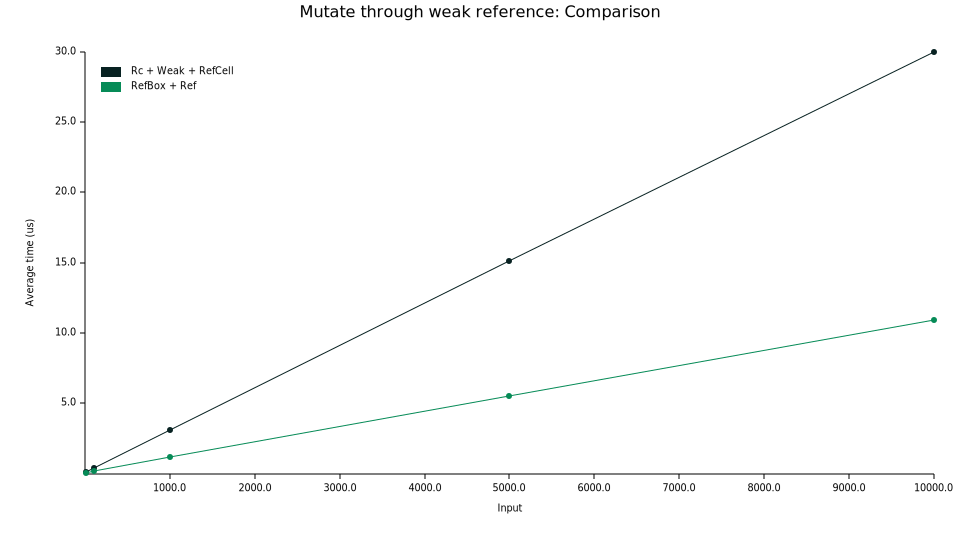

# RefBox

A `Box` with weak references.

A `RefBox` is a smart pointer that owns the data, just like a standard
`Box`. Similarly, a RefBox cannot be cloned cheaply, and when it is
dropped, the data it points to is dropped as well. However, a RefBox may
have many `Weak` pointers to the same data. These pointers don't own the
data and are reference counted, comparable to the standard library's
`std::rc::Weak`. As long as the RefBox is alive, Weak pointers can be used to
access the data from multiple places without lifetime parameters.

A RefBox could be seen as a lighter alternative to the standard library's
`Rc`, `std::rc::Weak` and `RefCell` combination, in cases where there is one
Rc with many Weak pointers to the same data.

Note: this crate is tested with unit tests, which were run with miri to check for 
undefined behavior and memory leaks. Still, the crate is considered to be in 
experimental state and the public api and implementation may change in the future.

## Tradeoffs

A RefBox does not differentiate between strong and weak pointers and
immutable and mutable borrows. There is always a *single* strong pointer,
zero, one or many weak pointers, and all borrows are mutable. This means
there can only be one borrow active at any given time. In return,
RefBox uses less memory, is faster to borrow from, and a Weak does not need
to be upgraded to access the data.

## Rc + Refcell vs. RefBox

|                                    | `Rc<RefCell<T>>`                                                             | `RefBox<T>`                                                                                                 |
|------------------------------------|------------------------------------------------------------------------------|-------------------------------------------------------------------------------------------------------------|
| Pointer kinds                      | Many `Rc` pointers and many `Weak` pointers                                  | One `RefBox` pointer and many `Weak` pointers                                                               |
| Clonable                           | Both `Rc` and `Weak` are cheap to clone                                      | Only `Weak` is cheap to clone                                                                               |
| Up-/Downgrading                    | `Rc` is downgradable, `Weak` is upgradable                                   | `RefBox` is downgradable                                                                                    |
| Data access through strong pointer | `RefCell::try_borrow_mut`                                                    | `RefBox::try_borrow_mut`                                                                                    |
| Data access through weak pointer   | 1. `Weak::upgrade`<br>2. `RefCell::try_borrow_mut`<br>3. Drop temporary `Rc` | `Weak::try_borrow_mut`                                                                                      |
| Simultaneous borrows               | One mutable OR multiple immutable                                            | One (mutable or immutable)                                                                                  |
| `T::drop` happens when             | When all `Rc`s are dropped                                                   | When the single `RefBox` is dropped                                                                         |
| Max number of `Weak` pointers      | `usize::MAX`                                                                 | `u32::MAX`                                                                                                  |
| Heap overhead                      | 64-bit: 24 bytes<br>32-bit: 12 bytes                                         | 8 bytes<br>With cyclic_stable enabled on 64-bit: 24 bytes<br>With cyclic_stable enabled on 32-bit: 12 bytes |
| Performance                        | Cloning is fast, mutating is slow                                            | Cloning is a tiny bit slower, mutating is much faster                                                       |

## Examples

```rust
use refbox::RefBox;

fn main() {
    // Create a RefBox.
    let ref_box = RefBox::new(100);

    // Create a weak reference.
    let weak = RefBox::downgrade(&ref_box);

    // Access the data.
    let borrow = weak.try_borrow_mut().unwrap();
    assert_eq!(*borrow, 100);
}
```

## Optional Features

* **cyclic_stable**: Enables the `RefBox::new_cyclic()` method on the stable release channel
  of Rust. This allows you to create data structures that contain weak references to (parts of)
  themselves in one go. To make it work, the memory layout of the type `T` is saved in the heap
  part of the `RefBox`. This increases the memory size of the heap part with `2 * usize`.
* **cyclic**: Enables the `RefBox::new_cyclic()` method on the nightly release channel without
  increasing the memory size of the heap part. This allows you to create data structures that
  contain weak references to (parts of) themselves in one go. Requires the nightly feature
  `layout_for_ptr`.

## Performance comparison

A number of benchmarks are included to compare the performance of `RefBox` vs `Rc`. Each benchmark follows the same process:

1. An `Rc` or `RefBox` is created, with optionally a weak reference;
2. An operation is performed for x number of times;
3. The Rc or RefBox is dropped.

The horizontal axes show the number of times the operation was performed. The vertical axes show the average time it took to complete the entire process described above.

The benchmarks are performed on an HP Intel Core i7-7700HQ CPU @ 2.80GHz, Windows 10 64-bit. You are encouraged to perform the benchmarks yourself as well.

**Mutating through the owner takes less time (only ~80%):**


**Mutating through a weak reference takes much less time (only ~36%):**



**However, creating, cloning and dropping weak references takes a little bit more time:**


## License

Licensed under either of

 * Apache License, Version 2.0
   ([LICENSE-APACHE](LICENSE-APACHE) or http://www.apache.org/licenses/LICENSE-2.0)
 * MIT license
   ([LICENSE-MIT](LICENSE-MIT) or http://opensource.org/licenses/MIT)

at your option.

## Contribution

Unless you explicitly state otherwise, any contribution intentionally submitted
for inclusion in the work by you, as defined in the Apache-2.0 license, shall be
dual licensed as above, without any additional terms or conditions.